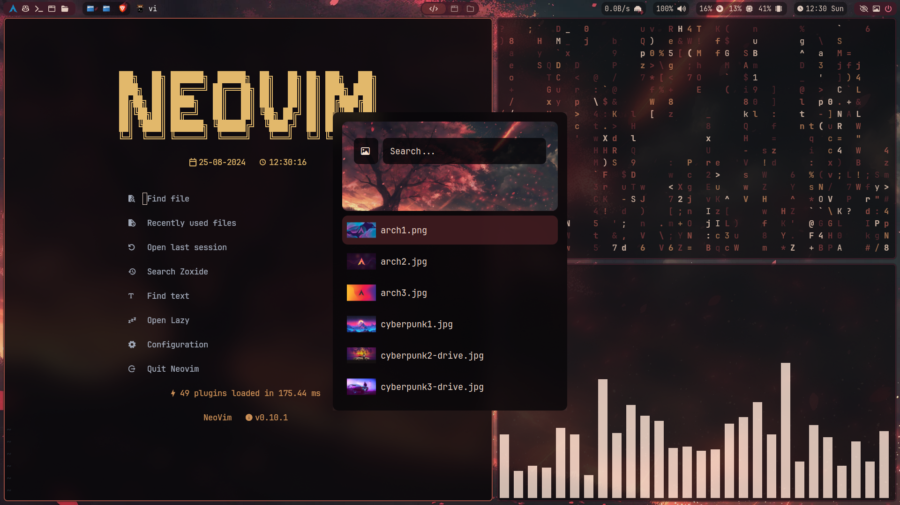
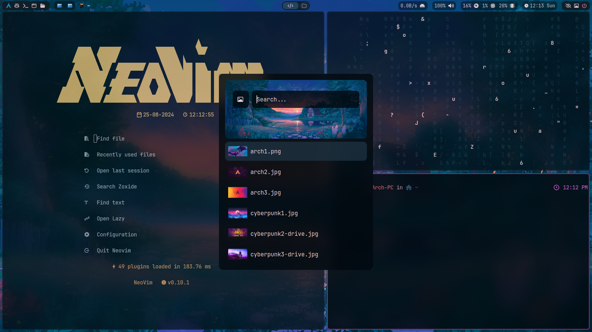
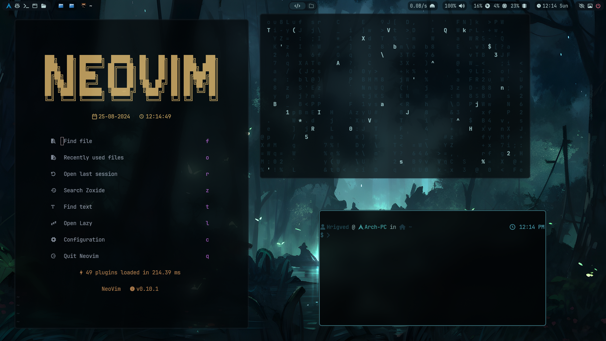
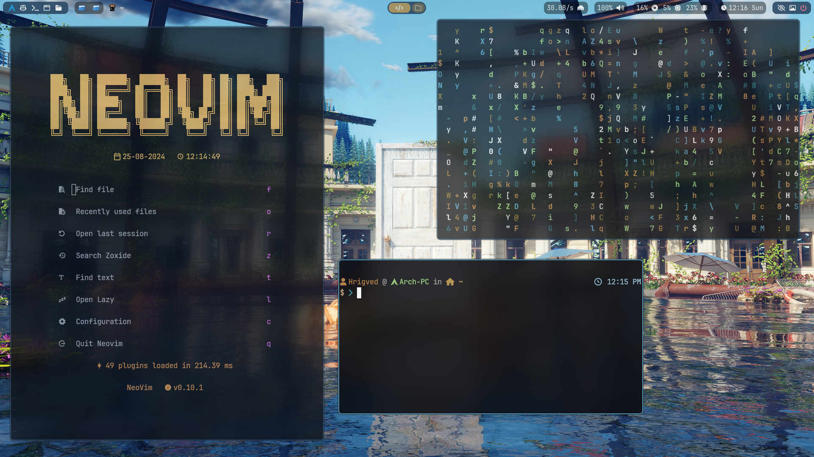
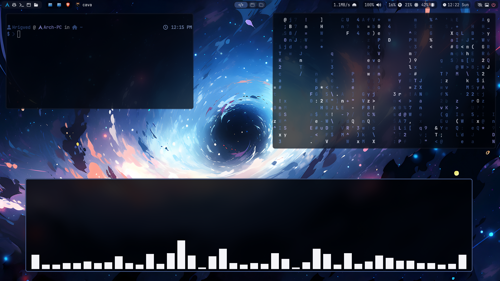
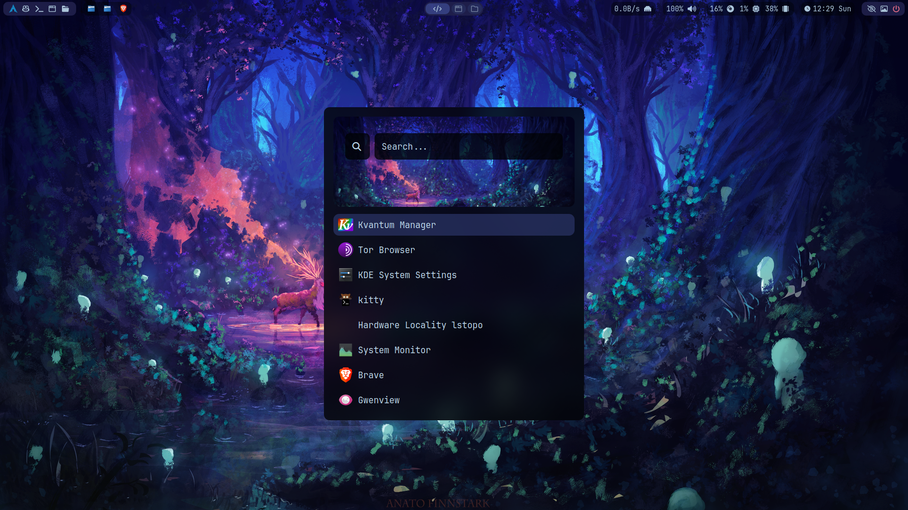
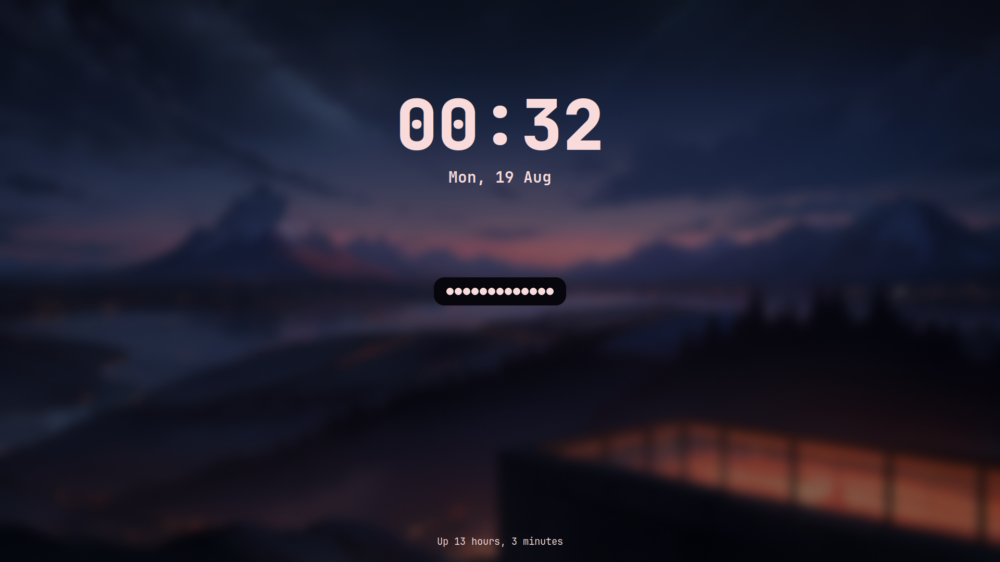

<h2 align="center">✨ My personal Hyprland dotfiles ✨</h2>

    <table>
        <h4>Rofi</h4>
        <tr>
            <td></td>
            <td></td>
        </tr>
    </table>
    <table>
        <h4>Hyprlock</h4>
        <tr>
            <td></td>
            <td></td>
        </tr>
    </table>
    <table>
        <h4>Wlogout</h4>
        <tr>
            <td></td>
            <td></td>
        </tr>
    </table>

## Installation

**You can install these by just copy-pasting the files in your own config 😃**
